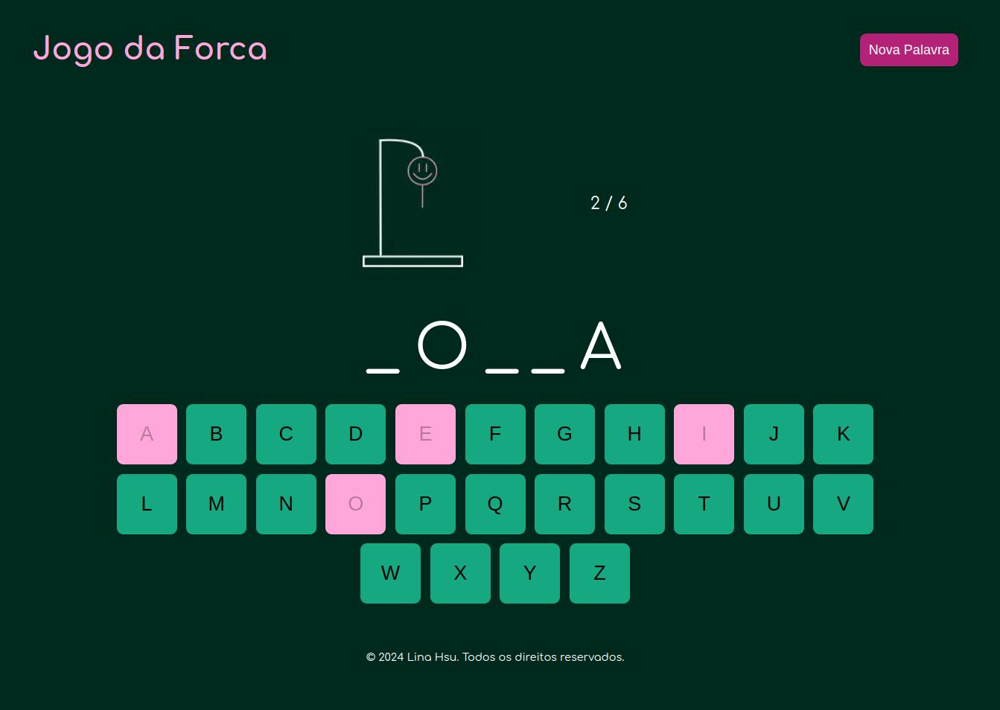
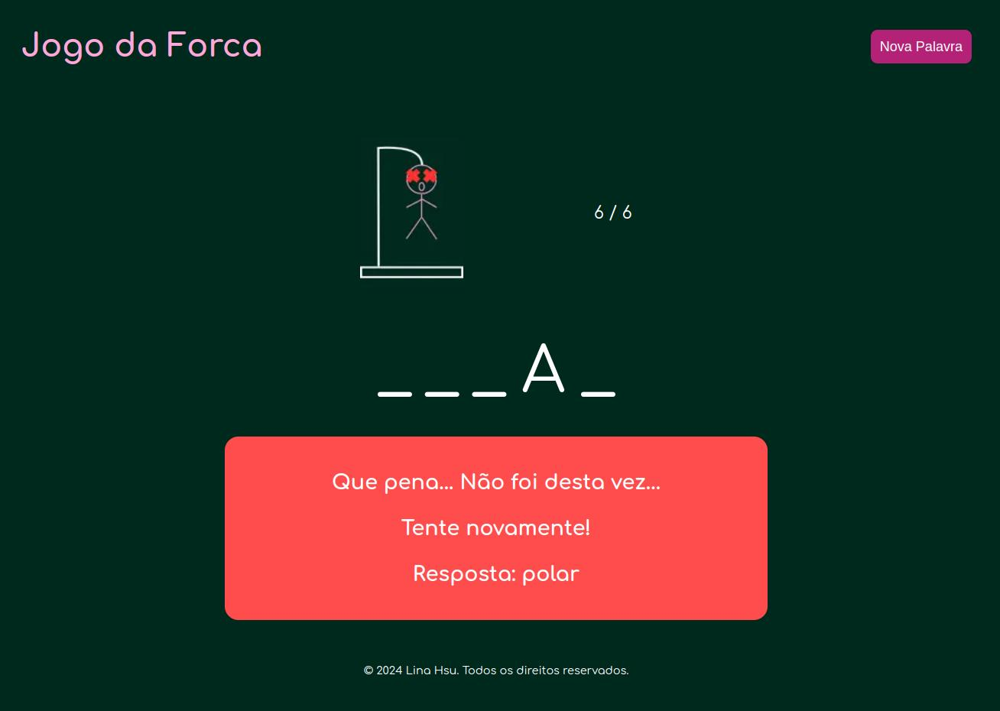

# Bem vindos ao repositório do Hangman-Game! 🎮

Esta é uma aplicação Full-stack **React - Next.js** + **Adonis**, utilizando **Styled-Components** para estilização.

Este projeto consiste em um jogo da forca interativo, Divirta-se tentando acertar a palavra à moda antiga! 🎇

Esta aplicação web contêm os seguintes elementos:

- **Header**: Com um botão para reiniciar o jogo com uma nova palavra.
- **Imagem da forca e contador dos erros**: A imagem e o contador são atualizados a cada erro.
- **Campos para cada letra da palavra**: Os campos das letras são atualizados a cada letra acertada.
- **Teclado interativo**: Escolha a letra desejada clicando nela.
- **Mensagem de vitória ou perda ao fim do jogo**: Saiba quando for o fim do jogo com a mensagem personalizada.






## Executando o Projeto com Docker 🐋

⚠️ **É necessário ter o Docker instalado na sua máquina**

1 - Clone o repositório com o comando:

```bash
git clone git@github.com:linahsu/hangman-game.git
```

2 - Entre na pasta do projeto:

```bash
cd hangman-game
```

3 - Renomeio o arquivo **.env.example** para **.env** na raíz do projeto e certifique-se que as seguintes variáreis de ambiente estejam assim:

```bash
HOST=0.0.0.0
PORT=3333
```

4 - Suba os containeres com o comando:

```bash
docker-compose up -d
```

5 - Abra **http://localhost:3000** com o seu navegador para visualizar o projeto rodando.

</br>

## Executando o Projeto Localmente 💻

⚠️ **É necessário uma versão Node igual ou superior à 20**

1 - Clone o repositório com o comando:

```bash
git clone git@github.com:linahsu/hangman-game.git
```

2 - Entre na pasta do projeto e no backend:

```bash
cd hangman-game
cd backend
```

3 - Instale as dependências:

```bash
npm install
```

4 - Execute o backend com o comando:

```bash
adonis serve --dev
```

5 - Entre na pasta do frontend:

```bash
cd ..
cd frontend
```

6 - Instale as dependências:

```bash
npm install
```

7 - Execute o frontend com o comando:

```bash
npm dev
```

8 - Abra **http://localhost:3000** com o seu navegador para visualizar o projeto rodando.
